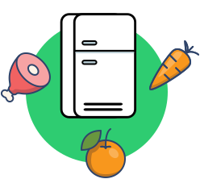

<h1 align="center"><b>Fridgeful</b></h1>


Our team, Console-loggers created the app 'Fridgeful' based on the slogan 'Buy wisely, Cook fridgefully, Eat it all' to reduce food waste and use 100% what you have in your fridge.
'Fridgeful' allows you to manage the ingredients in your fridge as well as generate recipes with them. It also helps to create shopping lists based on the ingredients or recipes you have chosen.


<br>


<p align="center">
  
</p>

---

### See live demo here:
```
https://be-fridgeful.netlify.app/
```

<br>


### Tech Stack we used

- **Client:** 
```
ReactJS, PWA, Sass, Auth0, Cypress, Netlify
```

- **Server:** 
```
NodeJS, PostgreSQL, Express, Postman, Heroku
```

<br>

### To install dependencies:
```
npm i
```

<br>

### To start the project
```
npm start
```


